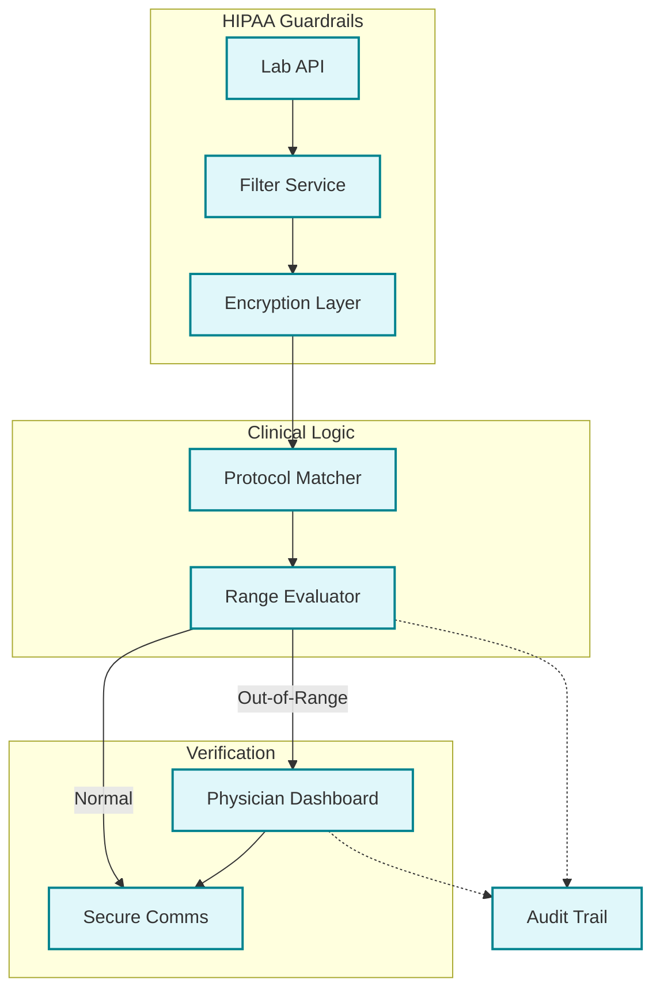

# 🏗️ Technical Architecture — healthcare-lab-automation

## Components
- **Minimum-Necessary Filter**: A specialized node that strips all non-essential metadata from lab reports before internal processing.
- **Protocol Range Engine**: Instead of using generic laboratory ranges, this engine evaluates results against the practice's specific longevity protocols.
- **Physician Dashboard**: A secure interface where doctors must approve and sign off on all results that fall outside of pre-defined limits.

## Data Flow
1. **Extraction**: Lab results are pulled via secure API; PHI is immediately filtered to the minimum required data.
2. **Evaluation**: Data is compared against custom reference ranges defined by the clinic's protocols.
3. **Triaging**: Results are split into "Normal" and "Attention Required" categories.
4. **Approval**: A physician reviews all "Attention Required" results and adds clinical notes.
5. **Notification**: Secure communication is sent to the patient only after the physician's review is finalized.

## Resilience & Compliance
- **Data at Rest**: All patient data stored within the platform is encrypted using industry-standard AES-256.
- **Access Controls**: The system maintains an access-controlled audit log, recording who accessed what data and when.
- **Isolation**: The environment is strictly isolated from public-facing infrastructure to prevent unauthorized access.

## Confidentiality
All HIPAA-protected information, specific clinical protocols, and workflow exports are withheld to ensure regulatory compliance and client privacy.
