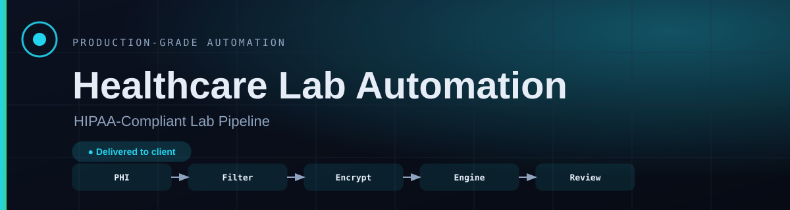
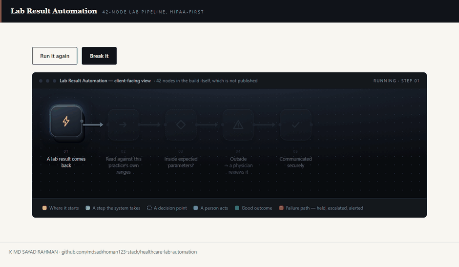
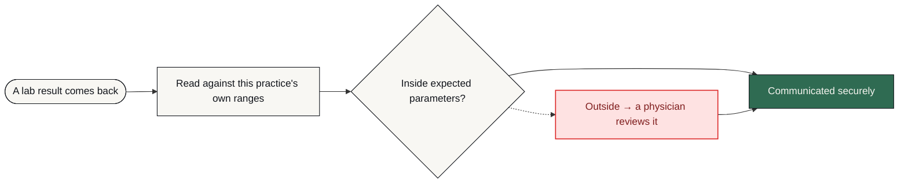

# Lab Result Automation

**Lab results are interpreted against protocol-specific ranges and routed to a physician when they fall outside them — with every touch of patient data logged.**

     [](https://github.com/mdsadrhoman123-stack/healthcare-lab-automation/actions/workflows/honesty-check.yml)



**The system in five seconds, then the same system failing on purpose.** The second half is the half most portfolios leave out. That is a recording of [`docs/index.html`](docs/index.html) in this repository — one file, no build step, no network — with the **Break it** button actually pressed, not illustrated.

> [!NOTE]
> **What this is.** A production-grade system built to a brief that businesses in this sector post publicly, in their own words — the problem exactly as they stated it, not one invented to demonstrate something. It was engineered the way anything a business actually depends on has to be: the failure paths designed before the features, every one of them logged and alerted rather than left to chance. It is built and documented in full, and deliberately held at validation stage. It is not cleared for live use yet, and it has not been sold or deployed into a customer's business.

> [!IMPORTANT]
> **This one is at validation stage — it has never been run against live patient records, and it must not be.** It is documented as scoped and built, not as a proven outcome. Compliance-critical systems do not go live on a single release.

| | |
| :--- | :--- |
| **Built for** | Longevity / hormone-optimization clinics (US) |
| **The brief** | The problem exactly as businesses in this sector post it — public job briefs on Upwork and Fiverr, in their words, not my framing |
| **Industry** | Healthcare |
| **Status** | prototype · validation stage |
| **Failure paths designed** | 6 — each with how it is detected, what the system does about it, and who finds out |
| **My role** | Sole engineer — scoping, architecture, build, failure design and operation |
| **Availability** | Built and documented in full, held at validation stage. Not cleared for live use, and not sold yet. |

---

### On this page

[The problem](#the-problem) · [What changed](#what-changed) · [How it works](#how-it-works) · [The shape of it](#the-shape-of-the-system) · [When it breaks](#when-it-breaks) · [Why this way](#why-it-is-built-this-way) · [Limitations](#honest-limitations) · [What is here](#what-is-in-this-repository) · [Read deeper](#read-deeper)

---

## The problem

Longevity and hormone-optimization practices run on a heavy cadence of lab work: bloodwork ordered, results returned, interpreted against protocol-specific reference ranges, then communicated with clinical context.

Done manually at scale this creates two compounding problems. Clinicians spend hours a week on data entry and formatting instead of patient care. And any system touching protected health information that was not architected around HIPAA from day one is a liability rather than an asset.

So compliance was treated as an architectural constraint, not a checkbox added after the workflow worked.

## What changed

| | Before | After |
| :--- | :--- | :--- |
| **Result interpretation** | Manual, per result | Automated against the practice's own ranges |
| **Out-of-range results** | Spotted if someone looks | Routed to a physician queue automatically |
| **Access to patient data** | Not systematically recorded | Logged with actor identity |
| **Data at rest** | Wherever it landed | Encrypted store |
| **Go-live** | One release and hope | Phase 0 validation before clinical use |

<sub>Before/after describes the change in process, not benchmarked throughput. Where a number is not measured, it is not claimed.</sub>

## How it works

Ingestion, encrypted storage with access logging, interpretation against the practice's own reference ranges, physician review routing for anything outside expected parameters, and secure patient communication — each stage designed against HIPAA's technical safeguards.

<table>
<tr>
<td width="42" valign="top" align="center"><b>01</b></td><td valign="top"><b>A result comes back</b><br>Ingestion validates it before anything is stored.</td>
</tr>
<tr>
<td width="42" valign="top" align="center"><b>02</b></td><td valign="top"><b>It is stored safely</b><br>Encrypted at rest, and the access is logged — because in healthcare who looked matters as much as what was stored.</td>
</tr>
<tr>
<td width="42" valign="top" align="center"><b>03</b></td><td valign="top"><b>It is read against the right ranges</b><br>Longevity and hormone protocols do not use standard clinical ranges. The interpretation uses the practice's own.</td>
</tr>
<tr>
<td width="42" valign="top" align="center"><b>04</b></td><td valign="top"><b>A physician decides the edge cases</b><br>Anything outside expected parameters goes to a physician queue. The system assists; it never decides.</td>
</tr>
<tr>
<td width="42" valign="top" align="center"><b>05</b></td><td valign="top"><b>The patient hears clearly</b><br>A summary with clinical context, delivered securely.</td>
</tr>
<tr>
<td width="42" valign="top" align="center"><b>06</b></td><td valign="top"><b>And it is all auditable</b><br>Every touch of patient data can be reconstructed afterwards.</td>
</tr>
</table>

### How it flows

<sub>What happens to the client's work, in the order they experience it. The internal build — node graph, execution order, prompts, thresholds — is deliberately not published.</sub>



<details>
<summary><b>What the shapes mean</b> — colour is not the only signal</summary>

| Shape | Means |
| :--- | :--- |
| **rounded** | Where the client's process starts |
| **box** | Something the system does |
| **diamond** | A decision point |
| **slanted** | A person has to act |
| **green box** | The good outcome |
| **red box** | Failure path — held, escalated or alerted |

Red appears in exactly one role across every repo in this portfolio: where failure goes. Nowhere else. If you see red, something is being held, escalated or alerted.
</details>

> **Walk it interactively** — [`docs/index.html`](docs/index.html) is a single self-contained page. Download it, open it in any browser, and press **Break it** to watch the failure path light up. Nothing to install, no network calls.

## The shape of the system

Parts and the role each one plays. Not the wiring — no execution order, no prompt text, no thresholds. That is a deliberate line, and the last branch of the tree names exactly what sits on the other side of it.

```text
Lab Result Automation — the running system
│
├── Memory .......................... what is remembered, and for how long
│   └── PostgreSQL (encrypted) ...... Encryption at rest, access logged per read and write
│
├── Oversight ....................... how a human stays in the loop
│   └── Audit logging ............... Actor identity recorded on every touch of patient data
│
├── Ground .......................... what the whole thing runs on
│   ├── n8n ......................... Self-hosted orchestration — PHI stays inside the practice's boundary
│   └── Secure API integrations ..... Encryption in transit between every stage
│
├── Failure design .................. 6 paths, designed before the features
│   ├── detected by ................. an error output, a timer, or a failed connection
│   ├── handled by .................. falling back, holding, or halting — never guessing
│   └── announced to ................ a named person, with the reason attached
│
└── Not in this repository .......... the part that would let you skip the thinking
    ├── the node graph .............. which part runs after which, and on what condition
    ├── the thresholds .............. what counts as urgent, late, at capacity, a match
    └── the credentials ............. never committed, in any form, at any point
```

Read it as a set of decisions rather than a parts list. Every part is there because a specific failure or a specific constraint put it there, and the two sections below are the same story told twice: **When it breaks** is what each part is defending against, and **Honest limitations** is what it costs to have chosen that part and not another.

### Counted, not estimated

| | |
| :--- | :--- |
| Workflow nodes | **42** |
| Delivery milestone | **Phase 0 validation** |
| Autonomous clinical decisions | **0** |

<sub>These are counts from the built system — nodes, stages, versions, gates. No efficiency percentages are published here without a stated measurement method.</sub>

### Also worth knowing

- Scoped with a dedicated Phase 0 infrastructure validation milestone: compliance-critical systems do not go live on a single release.

## When it breaks

Most automation portfolios show you the happy path. The happy path is the easy half. This is the half that decides whether a system survives contact with a real business.

| What goes wrong | How it is detected | What the system does | Who finds out |
| :--- | :--- | :--- | :--- |
| **Result is outside expected range** | Reference range check | Routed to the physician queue — never auto-communicated | Physician notified |
| **Reference range is not configured** | Missing configuration | Held for physician review rather than compared to a generic range | Alert on the unconfigured marker |
| **Ingestion receives a malformed result** | Validation at ingestion | Rejected before storage, nothing partially written | Alert with the reference |
| **Any read or write of patient data** | Access logging | Not a failure — recorded so it can be audited later | Auditable after the fact |
| **Delivery to the patient fails** | Provider response | Held and retried; the record shows undelivered | Alert, not a silent drop |
| **Anything unanticipated** | Error handling per stage | Halt before patient communication | Alert with the record reference |

The default on an unhandled condition is to **stop and tell someone** — never to continue on a guess. A silent success is the failure mode that costs the most, because nobody goes looking for it.

## Why it is built this way

Three decisions, each with the option that was turned down and the price of turning it down. A choice with no cost attached to it was not a choice — it was a default, and defaults are not worth reading about.

<details open>
<summary><b>Why the physician queue cannot be taken out</b></summary>

**What it does.** Anything outside expected parameters routes to a person before it reaches a patient.

**What was turned down.** Releasing normal results automatically. That is where the volume is — and deciding that a result is normal is a clinical judgement, which is not a judgement this system is entitled to make on its own.

**What that costs.** A required bottleneck, permanently. Removing it would remove the reason the system is safe to use at all.

</details>

<details>
<summary><b>Why it is self-hosted, with every read logged</b></summary>

**What it does.** Orchestration stays inside the practice boundary, storage is encrypted at rest, and the actor is recorded on every single touch of patient data.

**What was turned down.** A hosted orchestrator. Someone else's uptime problem instead of the practice's — and protected health information transits a vendor, and the audit trail becomes only as complete as what that vendor exposes.

**What that costs.** The practice owns the infrastructure, and every read costs a log write. Interpretation is also bounded by the reference ranges configured here, so this is not a general clinical tool.

</details>

<details>
<summary><b>Why this one says Phase 0 out loud</b></summary>

**What it does.** It is described as validation, because it is not yet running against live patient records.

**What was turned down.** Describing it as production, like the others. It would read stronger in a portfolio — and it would be untrue, and in healthcare that is the exact claim a client would be right to check.

**What that costs.** It reads as the least finished project in the portfolio. That is a real cost, and it is the honest one.

</details>

Every cost above also appears in **Honest limitations** below. It is there twice on purpose: once as the reasoning, once as the consequence, so neither can be quietly dropped from the other.

## Honest limitations

Every design decision costs something. These are the trade-offs in this build, stated by the person who made them.

- Phase 0 validation. This is not yet running against live patient records, and it is described here as what it is.
- Interpretation is bounded by the reference ranges configured for this practice. It is not a general clinical tool.
- The physician queue is a required bottleneck. Removing it would remove the reason the system is safe to use.

## What is in this repository

Every file, and the question it answers. Same layout in all eleven repositories in this portfolio, so the second one you open needs no orientation at all.

```text
healthcare-lab-automation/
├── README.md ....................... ← you are here
├── SECURITY.md ..................... how to report something that should not be public
├── NOTICE.md ....................... what is withheld, and why
├── LICENSE ......................... covers the documentation, not a software grant
│
├── docs/ ........................... the long form — read in order or not at all
│   ├── index.html .................. the interactive demo, one file, no network
│   ├── 01-problem.md ............... the situation before, in full
│   ├── 02-journey.md ............... step by step, from their side
│   ├── 03-architecture.md .......... the diagrams, and why they are shaped that way
│   ├── 04-failure-handling.md ...... every failure path, and where it lands
│   ├── 05-stack.md ................. each choice, the option turned down, the cost
│   ├── 06-results.md ............... what is measured, and what is deliberately not
│   └── 07-limitations.md ........... the trade-offs, in detail
│
├── diagrams/ ....................... source, so the flow can be re-rendered
│   ├── pipeline-lr.mmd ............. the client-level flow, left to right
│   └── pipeline-tb.mmd ............. the same flow, top to bottom
│
├── assets/ ......................... local files only — nothing from a CDN
│   ├── banner.svg .................. the header on this page
│   ├── demo.gif .................... the recording at the top of this page
│   └── cta.svg ..................... the closing card
│
├── workflows/ ...................... empty on purpose — see below
│   └── README.md ................... why it is empty, in writing
│
└── .github/ ........................ the badge at the top of this page
    ├── honesty-check.py ............ the claim linter it runs
    └── workflows/
        └── honesty-check.yml ....... runs it on every push
```

There is no `src/` in that tree, and no `workflows/*.json`. That is not an omission — it is the design, and the next section says exactly what is being withheld and why.

## What is not in this repo

- **Data belonging to a real business.** None, in any form. Not anonymised, not sampled — there never was any.
- **Credentials and endpoints.** Never committed. See [`NOTICE.md`](NOTICE.md) for what is withheld, and [`SECURITY.md`](SECURITY.md) for how to report anything that slipped through.
- **The workflow itself.** No exports, no node graph, no execution order, no prompts, no scoring thresholds, no integration wiring — not sanitised, not partial, not in a screenshot. That is the build, and the build is not portfolio material.

This repository documents *how the problem was thought about* — the failure paths, the trade-offs, the reasoning. That is what tells you whether to hire someone. A copy of the wiring would not.

This is a portfolio repository documenting a system I designed and built. It is not a product you can clone and run against your own accounts.

## Read deeper

| | |
| :--- | :--- |
| [01 · The problem](docs/01-problem.md) | The situation before, in full |
| [02 · The journey](docs/02-journey.md) | Step by step, from their side |
| [03 · Architecture](docs/03-architecture.md) | Diagrams and the reasoning |
| [04 · Failure handling](docs/04-failure-handling.md) | Every path, and where it lands |
| [05 · The stack](docs/05-stack.md) | What was chosen and what was rejected |
| [06 · Results](docs/06-results.md) | What is measured and what is not |
| [07 · Limitations](docs/07-limitations.md) | The trade-offs, in detail |

---


### Tell me what the process is

I will tell you honestly whether automating it is worth your money — including when the answer is no.

**K MD SAYAD RAHMAN** — AI Automation Engineer  
n8n · AI agents · production reliability  
[khandokarsayad@gmail.com](mailto:khandokarsayad@gmail.com) · [mdsadrhoman123@gmail.com](mailto:mdsadrhoman123@gmail.com) · [LinkedIn](https://www.linkedin.com/in/khandokarsayad) · [More systems](https://github.com/mdsadrhoman123-stack)

