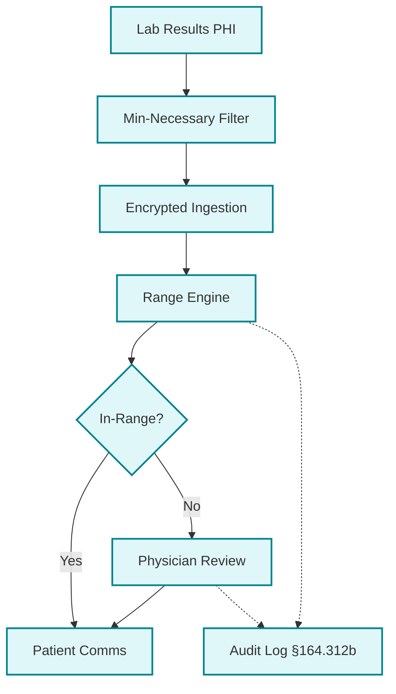
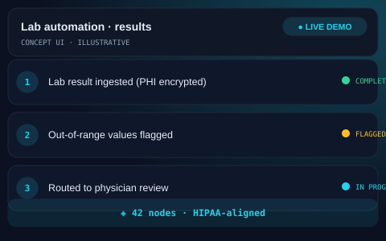

# 🧬 Healthcare Lab Automation — HIPAA-Compliant
> HIPAA-compliant lab result pipeline for a US longevity & hormone optimization practice.

   

## The Problem
A US-based medical practice was overwhelmed by the manual volume of lab result interpretation. High-volume data entry created significant bottlenecks and increased the risk of compliance violations during the handling of Protected Health Information (PHI).

## The Solution
This automation assists clinicians by filtering and routing lab results based on protocol-specific reference ranges. Built with HIPAA technical safeguards from the ground up, the system ensures that "automation assists, but physicians decide."
- **PHI-Safe Ingestion**: Strictly adheres to minimum-necessary data access.
- **Protocol-Specific Ranges**: Custom logic for longevity-focused optimization.
- **Physician-in-the-Loop**: Mandatory routing for all out-of-range findings.
- **Encrypted Audit Logging**: Full traceability per §164.312(b) requirements.

## Architecture at a Glance

## Key Metrics
| Metric | Value |
| :--- | :--- |
| Workflow Nodes | 42 |
| Security | 100% PHI Encrypted |
| Milestone | Phase 0 Validation |

## What Was Built
- [x] HIPAA-aligned infrastructure design.
- [x] "Minimum-Necessary" PHI data filter.
- [x] Protocol-specific reference range engine.
- [x] Mandatory physician review routing for outliers.
- [x] Access-controlled audit logging system.
- [x] Phase 0 validation milestone completion.

## Deliberately Not Published
- [ ] PHI and specific patient records (regulatory requirement).
- [ ] Workflow exports containing clinic-specific logic.
- [ ] Internal clinical protocols and staff contact data.

This repository is a portfolio presentation. No proprietary workflows, source code, or client data are published — by design.

## See It in Action

> Illustrative concept UI — a visual walkthrough of the workflow. Not a production screenshot.

## Tech Stack
- **Orchestration**: n8n
- **Security**: PostgreSQL (Encrypted at rest)
- **Infrastructure**: HIPAA-aligned VPS
- **Communication**: Secure API Integrations

[Architecture Deep-Dive](ARCHITECTURE.md) · [Case Study](CASE-STUDY.md)

---
Built by Sayad — AI Automation Engineer · Production-grade automation, not templates
